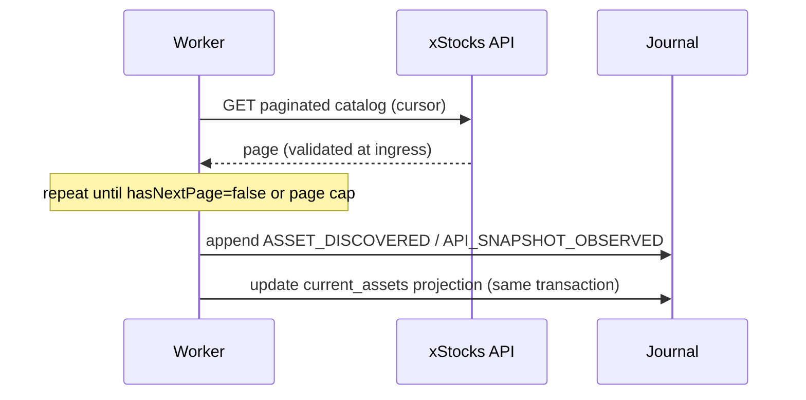
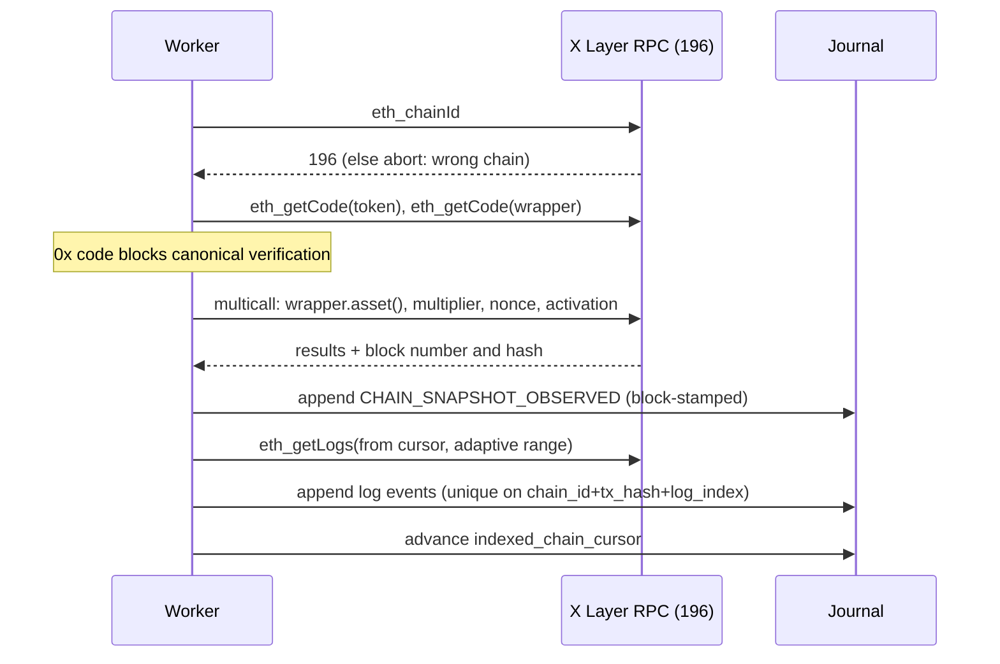
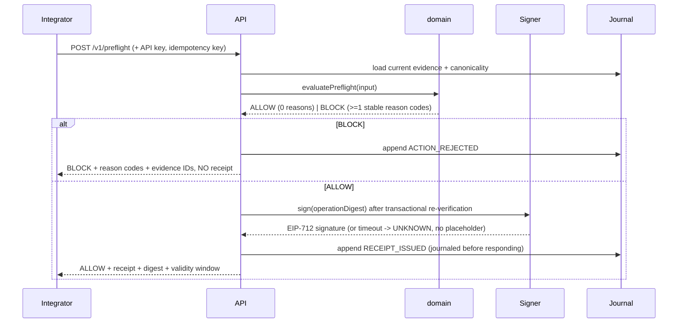
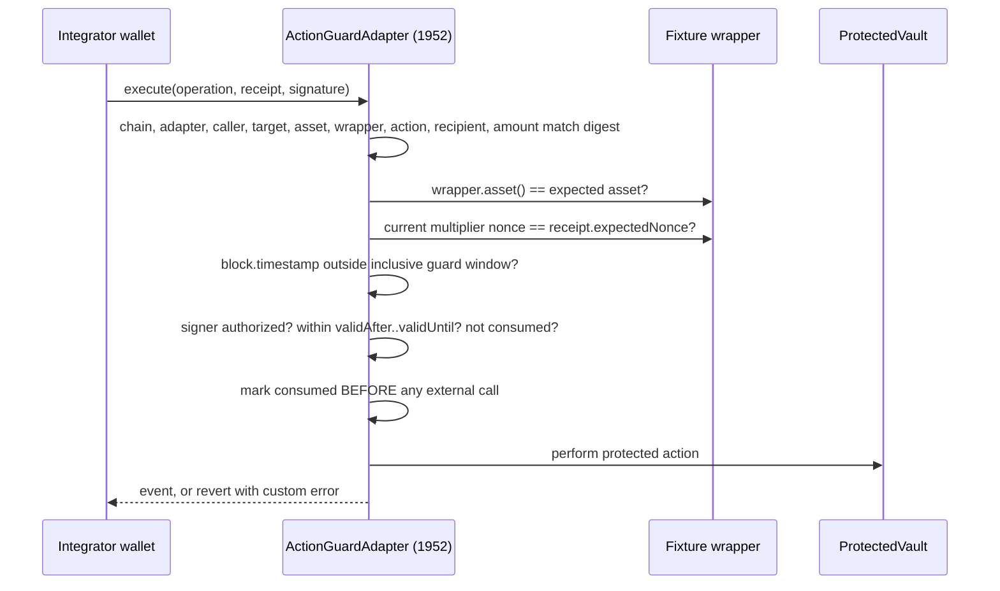

# Data flow

Six traced flows. Each names its inputs, its durable evidence, and its fail direction.

## 1. Asset discovery



Fail direction: a truncated or looping pagination run raises `incomplete-catalog` and does
**not** overwrite the previous catalog projection. The first page returning 100 assets is
never treated as proof the catalog holds only 100 assets.

## 2. Chain observation



`latest` is never used without recording the block that was returned. If a stored block
hash no longer matches, `REORG_DETECTED` is appended, the cursor rewinds to a safe block,
and affected projections are rebuilt. History is never erased.

## 3. Reconciliation and projection rebuild

```text
inputs   immutable API observations
       + immutable chain observations
       + canonicality records
       + now (supplied by caller, never Date.now() inside domain)
       + freshness and guard-window policy
         |
         v
  compareSources(api, chain, tolerance)  -->  MATCH | MISMATCH | INCOMPLETE
  deriveLifecycleState(input, now)       -->  NORMAL | PENDING | GUARD_WINDOW
                                              | APPLIED | RECONCILED
         |
         v
outputs  domain transitions + evidence events
         (the reconciler never writes UI projections directly and never signs)
```

`MISMATCH` escalates to `MANUAL_REVIEW` and can only reach `RECOVERED` when a later
*complete* observation agrees. An operator resolution records actor, reason, evidence, and
policy version — it cannot fabricate source agreement, and protected actions stay blocked
while evidence still disagrees.

## 4. Preflight request → receipt issuance



A receipt is never returned for `UNKNOWN` or degraded mandatory evidence.

## 5. Testnet receipt consumption



Any failed check reverts. No protected state change survives a failed guard.

## 6. Incident replay

```text
select incident -> choose evidence cutoff + policy version
  -> load immutable events up to cutoff (no live source calls)
  -> re-run the same pure domain functions
  -> compare replayed decision with the recorded decision
  -> export JSON/CSV evidence bundle (secret fields excluded)
```

Replay that calls a live source is not a replay. The policy and code version used are
always displayed with the result.
