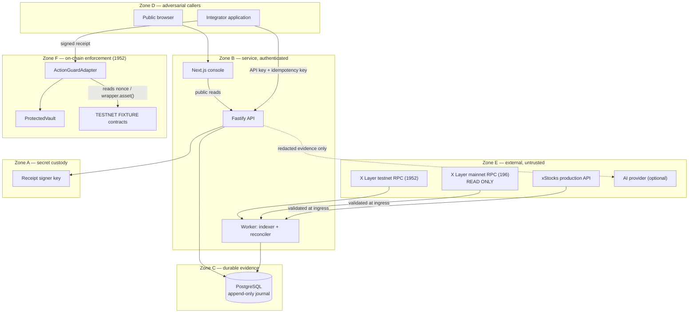

# System context

**Status:** frozen for the Corporate Action Guard build. Changes require a new ADR.

Corporate Action Guard protects an integration path from acting on stale xStocks
corporate-action state. This document names the actors, the trust zones, and the
behaviour of every boundary. It describes the _agreed target architecture_; it is not
a claim that every component is implemented. See `docs/build-readiness.md` for what
actually exists.

## Actors

| Actor                            | Kind                    | Trust                                 | Notes                                                                                                                                          |
| -------------------------------- | ----------------------- | ------------------------------------- | ---------------------------------------------------------------------------------------------------------------------------------------------- |
| Integrator application           | External system         | **Adversarial**                       | A wallet, exchange, vault, or lending protocol calling `POST /v1/preflight` and then the adapter. May mutate its payload after preflight.      |
| Operator                         | Human                   | **Authenticated**                     | Reviews incidents, records manual-review resolutions, triggers scoped reconciliation. Cannot manufacture source agreement.                     |
| Public browser visitor           | Human                   | **Untrusted**                         | Reads public evidence pages. No write scope.                                                                                                   |
| xStocks production API           | External service        | **Untrusted input, mandatory source** | Authoritative for the off-chain catalog; never sufficient alone to authorize an action.                                                        |
| X Layer mainnet RPC (chain 196)  | External service        | **Untrusted input, mandatory source** | Read-only. Authoritative for on-chain multiplier facts. A dishonest or lagging RPC must fail closed, not fail open.                            |
| X Layer testnet RPC (chain 1952) | External service        | **Untrusted input**                   | Read plus the single write path in the build.                                                                                                  |
| Receipt signer                   | Internal secret holder  | **Trusted-but-limited**               | Holds the EIP-712 key. Can assert off-chain agreement it did not verify; this is a recorded residual risk, not a solved problem. See ADR 0002. |
| PostgreSQL journal               | Internal store          | **Trusted**                           | Append-only evidence. Application credentials must not be able to UPDATE or DELETE journal rows.                                               |
| ActionGuardAdapter (chain 1952)  | On-chain contract       | **Trusted enforcement point**         | Re-verifies every bound field on chain. Does not trust the API, the UI, or an AI explanation.                                                  |
| AI explainer (optional)          | External model provider | **Non-authoritative**                 | Summarizes evidence. Structurally excluded from the money path.                                                                                |

## Trust zones

## Boundary contracts

Every external boundary declares timeout, retry, validation, and fail direction.

| Boundary                               | Timeout                                 | Retry                                                                                     | Validation                                                                                                                                     | On failure                                                                                                       |
| -------------------------------------- | --------------------------------------- | ----------------------------------------------------------------------------------------- | ---------------------------------------------------------------------------------------------------------------------------------------------- | ---------------------------------------------------------------------------------------------------------------- |
| API → xStocks API                      | connect 3s / response 10s / overall 20s | GET only, max 3, exponential backoff + jitter, honours `Retry-After`                      | Zod at ingress; unknown fields kept for diagnostics, never trusted                                                                             | **Fail closed.** Last-known-good may display with a `STALE` label but cannot authorize past its freshness limit. |
| Worker → X Layer mainnet RPC (196)     | per-call 5s, batch 15s                  | max 2 per provider, then fallback provider                                                | `eth_chainId` must equal 196; `eth_getCode != 0x` before an address is treated as a contract; block number and hash recorded on every snapshot | **Fail closed.** `RPC_UNAVAILABLE`. Never signs.                                                                 |
| Worker → X Layer testnet RPC (1952)    | per-call 5s                             | max 2                                                                                     | `eth_chainId` must equal 1952                                                                                                                  | **Fail closed.**                                                                                                 |
| Integrator → API                       | request 15s                             | client-driven; server enforces idempotency keys                                           | Zod on params/query/body/response; strict address and base-unit amount formats                                                                 | **Fail closed.** BLOCK with stable reason codes, no receipt.                                                     |
| API → receipt signer                   | 5s                                      | retry only by idempotency key; timeout is an _unknown_ outcome, never an implicit success | Signer re-loads and re-verifies the ALLOW decision and its evidence transactionally before signing                                             | **Fail closed.** Never emits a placeholder signature.                                                            |
| API/Worker → PostgreSQL                | 5s statement timeout                    | bounded, no retry inside a transaction                                                    | Schema constraints enforce idempotency                                                                                                         | **Fail closed.** Readiness turns unhealthy; liveness stays up.                                                   |
| Integrator → ActionGuardAdapter (1952) | n/a (on chain)                          | n/a                                                                                       | Full on-chain re-verification of every bound field                                                                                             | **Revert** with a custom error.                                                                                  |
| API → AI provider                      | 10s                                     | max 1                                                                                     | Structured output schema plus citation check against supplied event IDs                                                                        | **Degrade.** Falls back to the deterministic reason-code explanation. Cannot change ALLOW/BLOCK.                 |

## Enforcement boundary

The guard is enforceable **only** for applications that route protected actions through
`ActionGuardAdapter`. A user holding an xStock ERC-20 can transfer it directly and bypass
an optional adapter. This is never described as a universal X Layer firewall.
