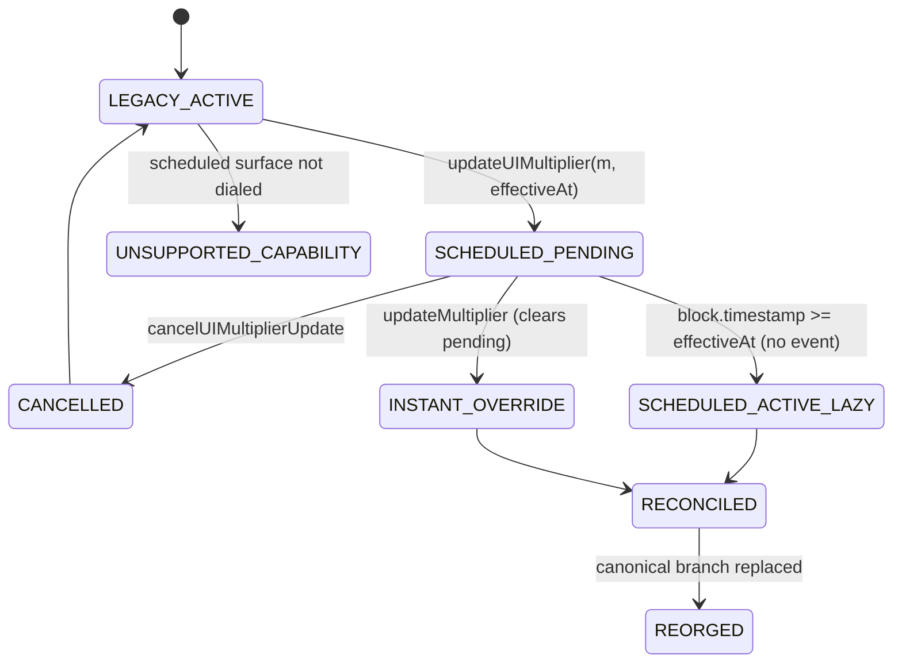

# Base B20 data flows

Eight traced flows. Each names where evidence is journaled and which way it fails.

## 1. Official asset discovery and address verification

```mermaid
sequenceDiagram
  participant OP as Operator
  participant CAP as b20-provenance capture
  participant LIST as base.org/stocks
  participant RPC as Base RPC (8453)
  participant REG as Asset registry
  participant J as Journal

  OP->>CAP: capture
  CAP->>LIST: GET (bounded, hashed)
  LIST-->>CAP: labelled rows -> (symbol, address)
  CAP->>RPC: eth_chainId
  RPC-->>CAP: 8453 (mismatch aborts)
  CAP->>RPC: name/symbol/decimals/multiplier/isB20Initialized at head-200
  CAP->>RPC: capability probes (undialed selector reverts with its own 4 bytes)
  CAP-->>OP: manifests written; partial reads refuse to write at all
  OP->>REG: commit reviewed manifest
  REG->>J: manifest observed / accepted
  REG->>REG: project VERIFIED only if list + isB20Initialized + live reads agree
```

Fails closed: an unparseable list, a partial read, or a chain-ID mismatch produces no manifest.

## 2. Historical backfill and reorg compensation

Bounded block ranges with adaptive shrink on provider limits; a durable cursor behind a fenced
lease; the cursor advances only after the journal commit. A parent-hash mismatch inside the
configured lookback rewinds and journals a compensation event. Deeper than the lookback is
`REORGED` / `MANUAL_REVIEW` — never a silent rewrite. Raw observations are never deleted.

## 3. Scheduled update, cancel, maturity, instant override



On Base mainnet today the scheduled surface is **not dialed**, so the reducer returns
`UNSUPPORTED_CAPABILITY` for that path rather than "no pending update". The lazy activation
transition fires with no event at all, which is why activation is computed from block
timestamp and never from event arrival.

## 4. Chainlink normal, paused, off-hours, stale

One `latestRoundData` read produces four distinguishable outcomes, resolved in this order:
sequencer down or in grace → `SEQUENCER_UNAVAILABLE`; issuer pause → `ISSUER_PAUSED`; invalid
round (zero or negative answer, `updatedAt` zero or in the future, `answeredInRound` behind
`roundId`, wrong decimals) → `INVALID_ROUND`; age beyond the action class's limit →
`EXPECTED_HOLD` only when a declared session policy says so and source state is otherwise
fresh, else `STALE`. Off-hours is never silently called fresh.

## 5. Wallet position materialization

`balanceOf` → `rawAmount`; `rawAmount` + active multiplier → `shareEquivalent` + remainder;
`shareEquivalent` or `rawAmount` + a basis-typed price → value by route A or B, with both
compared when available. Every step records the block and round it used.

## 6. Integration conformance replay

A versioned scenario plus a seed drives a deterministic fixture set through the customer's
declared adapter. Each case records input fixture hashes, expected invariant, observed output,
reason-code diff and duration. A pass requires the _correct negative_ behaviour; a generic
error where a specific safe state is required is a failure. The mutation corpus proves the
suite has teeth: correct code passes and the targeted mutant fails for the intended reason.

## 7. Preflight → receipt → adapter execution

```mermaid
sequenceDiagram
  participant APP as Integrator
  participant API as /v1/b20/preflight
  participant DB as Journal + idempotency
  participant EV as Readers
  participant SG as Signer (KMS)
  participant AD as B20GuardAdapter

  APP->>API: operation + Idempotency-Key
  API->>DB: persist intent + canonical hash BEFORE deciding
  DB-->>API: existing result on replay; 409 on same key, different body
  API->>EV: mandatory evidence for this action class
  EV-->>API: block/round-stamped facts, or unavailable
  API->>API: decide ALLOW / BLOCK / REVIEW with reason codes
  API->>EV: re-read inside a bounded issuance window
  API->>SG: sign only if still ALLOW
  SG-->>API: signature; receipt identity reserved atomically
  API-->>APP: outcome + evidence IDs (+ receipt if ALLOW)
  APP->>AD: execute with receipt
  AD->>AD: verify signer, domain, binding, expiry; re-read multiplier on chain
  AD->>AD: consume receipt ID once, then execute
```

State changing between decision and signature yields `BLOCK`/`REVIEW` and no signature.

## 8. Post-action reconciliation and evidence export

The state machine walks `DISCOVERED → OBSERVING → NORMAL → ACTION_PENDING → GUARD_WINDOW →
ACTION_EFFECTIVE → RECONCILING → VERIFIED`, with `CONFLICT`, `INSUFFICIENT_EVIDENCE`,
`REORGED` and `MANUAL_REVIEW` reachable from any eligible state. Every transition is journaled
before any projection updates, and recovery requires new evidence and a new transition — never
an edited row. The export is content-addressed and independently verifiable without trusting
a UI success flag.
