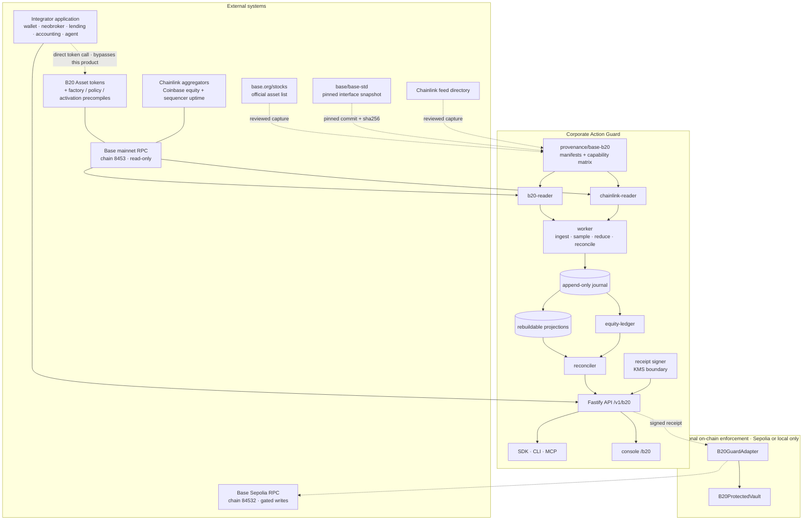

# Base B20 system context

Who talks to what, what each boundary authenticates, and which way it fails.

## Boundaries

| Boundary                                 | Authentication                                             | Timeout / bound                                       | Provenance recorded                                                | Fails                                                          |
| ---------------------------------------- | ---------------------------------------------------------- | ----------------------------------------------------- | ------------------------------------------------------------------ | -------------------------------------------------------------- |
| base.org/stocks → provenance             | none (public)                                              | 30 s, 8 MB body                                       | URL, retrieval time, body sha256, parsed row count                 | closed — zero rows parsed is an error, never a cached fallback |
| base-std → provenance                    | none (public git)                                          | clone depth 1                                         | commit, commit date, per-file sha256                               | closed — a missing file fails capture                          |
| Chainlink directory → provenance         | none (public)                                              | 30 s, 8 MB body                                       | URL, retrieval time, body sha256, entry count                      | closed                                                         |
| Base mainnet RPC → readers               | endpoint credential, never logged or written to a manifest | per-call timeout, bounded retries, bounded log range  | chain ID, block number, block hash, block timestamp, endpoint host | closed — a chain-ID mismatch aborts the session                |
| Chainlink aggregator → chainlink-reader  | none beyond RPC                                            | same                                                  | proxy address, round ID, `updatedAt`, decimals, block              | closed — an invalid round is `unavailable`, never a price      |
| Sequencer uptime feed → chainlink-reader | none beyond RPC                                            | same                                                  | round, answer, `startedAt`                                         | closed — down or in grace blocks value-sensitive actions       |
| Integrator → API                         | tenant credential, RBAC per capability                     | request size, rate limit, cursor bounds               | correlation ID, tenant, idempotency key                            | closed — never a partial success                               |
| API → signer                             | KMS key identity, distinct from any deployment key         | bounded issuance window                               | key ID, signed digest                                              | closed — no signature on a changed result                      |
| Adapter → chain                          | on-chain signature verification                            | —                                                     | receipt ID consumed exactly once                                   | closed — reverts                                               |
| Announcement URI fetch (when enabled)    | HTTPS allowlist / constrained resolver                     | bounded redirects, body, time; content-type validated | URL, body hash                                                     | closed — treated as untrusted data regardless                  |

## Trust statements

- Chain state proves on-chain facts. It does not prove a legal or accounting meaning.
- Announcement descriptions and URI contents are untrusted input, stored as evidence and
  obeyed by nothing.
- The official asset list establishes issuer provenance. The address prefix does not.
- A compromised receipt signer can falsify off-chain agreement; it cannot rewrite chain state,
  and the adapter's on-chain multiplier re-read is the independent check.
- Adapter and vault enforcement is scoped to funds routed through them, never universal.
- Tax and legal classification is not delegated to a model. See ADR 0008.
