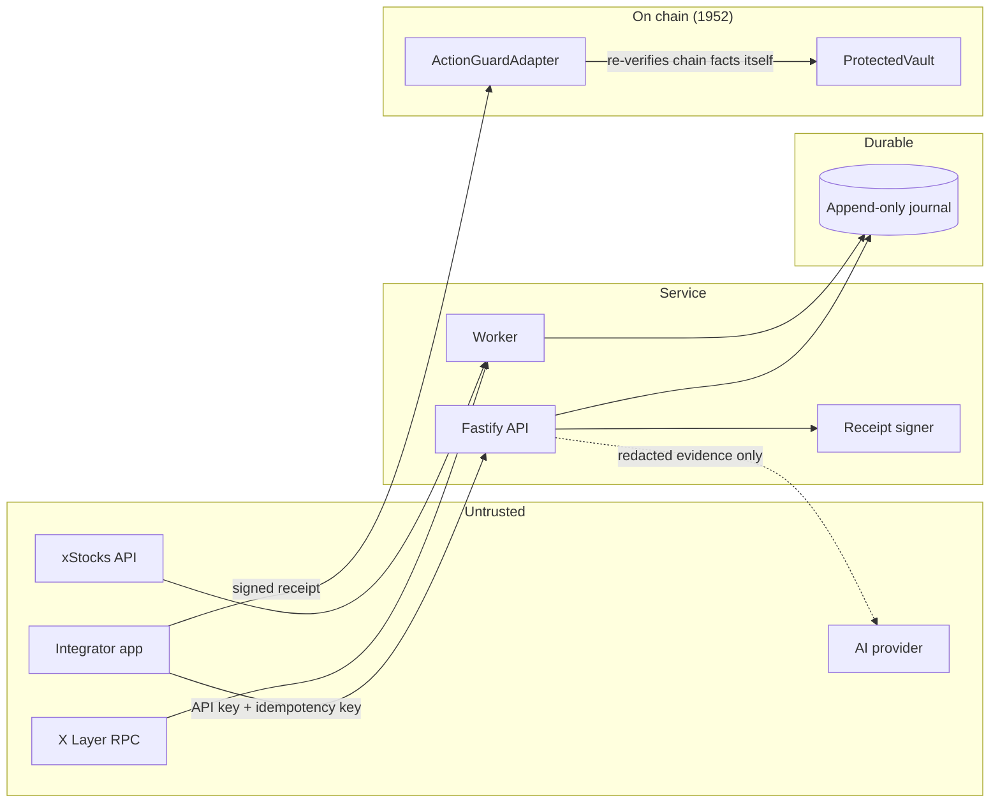

# Threat model

**Not an audit.** This is the team's own review of its own code. No external party has
examined this repository. Nothing here should be read as an assurance.

## Trust diagram

## Assets worth protecting

1. **The authorization decision.** An ALLOW that should have been a BLOCK moves money on
   wrong assumptions. This is the only asset that really matters.
2. **The receipt signing key.** It can assert off-chain agreement the adapter cannot check.
3. **The evidence journal.** If history can be rewritten, no incident can be investigated.
4. **Operator credentials.** They gate review resolution and scoped reconciliation.

## Threat actors and what stops them

| Actor                                                         | Capability                                               | Mitigation                                                                                                                                                                                                                                                   | Verified by                                                                 |
| ------------------------------------------------------------- | -------------------------------------------------------- | ------------------------------------------------------------------------------------------------------------------------------------------------------------------------------------------------------------------------------------------------------------ | --------------------------------------------------------------------------- |
| Unauthenticated internet client                               | Read public evidence                                     | Scoped API keys; public routes expose no secrets                                                                                                                                                                                                             | `auth.test.ts` scope matrix                                                 |
| Compromised or revoked API key                                | Request preflight as a principal                         | Hashed keys, constant-time compare, revocation checked after the hash so it is timing-indistinguishable from an unknown key                                                                                                                                  | `auth.test.ts`                                                              |
| **Malicious integrator mutating the payload after preflight** | Change recipient, amount, target, asset, wrapper, action | The adapter recomputes the operation digest from the fields actually presented and reverts on any difference                                                                                                                                                 | 10 TS mutation tests + 10 Solidity mutation tests + fuzz                    |
| **Compromised receipt signer**                                | Assert off-chain agreement that never happened           | **Not fully mitigated.** The adapter independently verifies nonce, `wrapper.asset()`, guard window, binding, expiry and consumption, but cannot verify the API agreed. Bounded by short lifetimes, single consumption, signer allowlist, two-step ownership. | ADR 0002; `test_RevokedSignerIsRejected`                                    |
| Dishonest or lagging RPC                                      | Return wrong chain state                                 | `eth_chainId` checked before use; `eth_getCode` proves bytecode; block number and hash recorded on every read; provider recorded per read                                                                                                                    | `reader.test.ts` wrong-chain and no-bytecode cases                          |
| Malformed or compromised API response                         | Inject bad addresses or values                           | Zod at ingress; malformed EVM addresses rejected, not normalized; no fallback to bundled data                                                                                                                                                                | `client.test.ts`                                                            |
| Malicious token or wrapper                                    | Lie about its own asset, or take a fee on transfer       | `wrapper.asset()` checked on chain every execution; fee-on-transfer refused loudly rather than credited short                                                                                                                                                | `test_WrapperPointingAtAnotherAssetIsRejected`, `FeeOnTransferNotSupported` |
| Concurrent or replayed request                                | Double-spend a receipt                                   | Receipt marked consumed **before** any external call; `nonReentrant`; DB single-winner consumption                                                                                                                                                           | `test_ValidReceiptSucceedsExactlyOnce`, journal race test                   |
| Operator mistake                                              | "Mark safe" a real mismatch                              | Resolution requires a ≥20-character reason plus an evidence reference; it cannot create source agreement; `MANUAL_REVIEW_RESOLVED` returns to `MANUAL_REVIEW`, not `RECOVERED`                                                                               | `schemas.test.ts`, `lifecycle.test.ts`                                      |
| Compromised logs or browser                                   | Harvest secrets from output                              | Central redaction by key name **and** value shape; browser bundle scanned in CI                                                                                                                                                                              | 33 observability tests with canaries                                        |
| Shallow chain reorg                                           | Leave a stale receipt usable                             | Reorg detected by block-hash comparison; cursor rewinds; compensating evidence appended; history retained                                                                                                                                                    | `detectReorg` tests                                                         |

## Adversarial proofs performed

| Proof                                              | Result                                                 |
| -------------------------------------------------- | ------------------------------------------------------ |
| Mutate **every** receipt-bound field after signing | Rejected, 10/10 fields, both languages                 |
| Replay a consumed receipt                          | `ReceiptAlreadyConsumed`                               |
| Replay across chain                                | Digest mismatch                                        |
| Replay across adapter deployment                   | Digest mismatch                                        |
| Replay across caller                               | `CallerMismatch`                                       |
| Replay across target                               | `TargetNotAllowed`                                     |
| Race two receipt consumers in the database         | Exactly one state change                               |
| Race three lease acquisitions                      | Exactly one winner                                     |
| Crash between journal append and projection update | Neither persists                                       |
| Wrong-chain RPC                                    | `WRONG_CHAIN`, fails closed                            |
| False API canonical address                        | `NON_CANONICAL_TOKEN`, fails closed                    |
| Remove any subset of evidence                      | Never improves a decision (400-run property test)      |
| **Weaken any predicate in the safety check**       | Suite fails, 23/23 mutants killed                      |
| Direct ERC-20 transfer                             | **Succeeds** — documented boundary, asserted as a test |
| Journal `UPDATE` / `DELETE` via the app role       | Rejected by trigger                                    |
| Plant a secret in a tracked file                   | Detected by the scanner                                |
| Plant a secret in the browser bundle               | Detected by the bundle scan                            |

## Residual risks — accepted, not solved

| Risk                                                   | Why it remains                                          | Bounded by                                                                                              |
| ------------------------------------------------------ | ------------------------------------------------------- | ------------------------------------------------------------------------------------------------------- |
| **Signer key in process memory**                       | HSM/KMS is out of scope for an event build              | Testnet-only writes, short receipt lifetime, single consumption, allowlist, two-step rotation           |
| **Single RPC provider may be dishonest**               | Multi-provider quorum out of scope                      | Chain-ID check, bytecode check, provider recorded per read                                              |
| **Reorg deeper than the confirmation depth**           | X Layer finality is not documented in a verifiable form | Conservative configurable depth (32), labelled as an assumption in every snapshot                       |
| **`block.timestamp` is proposer-influenced**           | It is the only on-chain clock                           | The guard window is a margin in _minutes_, far wider than any plausible manipulation                    |
| **Production xStocks scheduling semantics unverified** | Not published in a verifiable form                      | Only confirmed read selectors implemented; event capabilities declared unsupported rather than invented |
| **The adapter is optional**                            | It is an integration, not a chain-level rule            | Stated in the README, in the contract NatSpec, in the console footer, and asserted as a test            |

## Out of scope

Denial of service against public RPC or the xStocks API; compromise of the integrator's own
wallet; social engineering of an operator; physical access to infrastructure; the security
of the production xStocks contracts themselves.

## Verdict

No critical or high finding is outstanding **in the code that exists**. That statement is
narrower than it sounds: several modules are not yet implemented, and the release is not
claimed to be ready. See `docs/final-audit.md`.
