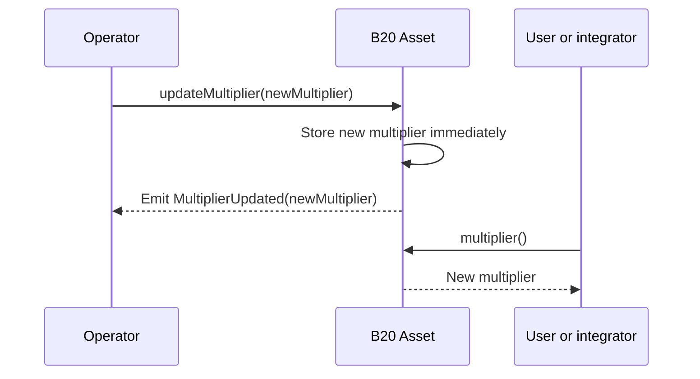
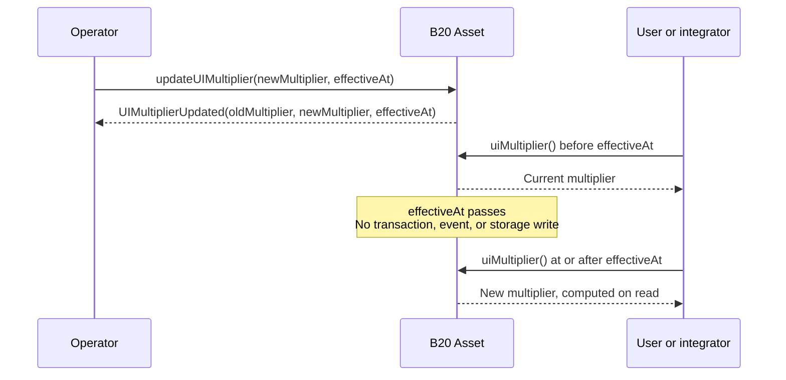
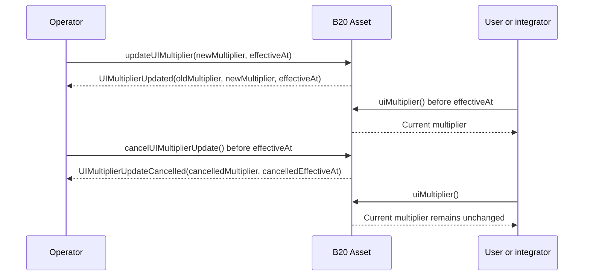

# Schedule Multiplier Updates (ERC-8056)

- **Feature Name**: Scheduled Multiplier
- **Start Date**: 2026-08-17
- **Authors**: Rayyan Alam and Markus
- **Title**: Schedule Multiplier Updates (ERC-8056)

## Summary

Stock issuers and tokenization platforms need to support corporate actions such as stock splits and reverse stock splits. This change implements ERC-8056 for B20 Asset in the Cobalt hardfork. Which allows issuers to schedule a multiplier change for a specific future timestamp instead of applying it immediately.

Issuers and operators can now use `updateUIMultiplier` to schedule a change and `cancelUIMultiplierUpdate` to cancel a pending change. The existing `updateMultiplier` function remains available as an emergency failsafe that applies a change immediately. All three functions require `OPERATOR_ROLE`.

Scheduling a multiplier update leaves raw token balances unchanged and changes only their UI representation. UI values use the current multiplier before the effective timestamp and the scheduled multiplier at or after it. Integrators can prepare for this transition by reading pending updates on-chain and listening for the canonical `UIMultiplierUpdated` event.

## Motivation

Traditional financial institutions coordinate stock splits, reverse stock splits, and reinvested dividends around an agreed effective time, often at the start of the next trading day. Exchanges, custodians, and accounting systems need advance notice so they can prepare before the action takes effect.

The existing `updateMultiplier` function applies a multiplier change when its transaction lands on-chain. Because transaction inclusion time is unpredictable, operators cannot use this function to guarantee an agreed effective timestamp. Operators need to be able to submit a transaction in advance and schedule the change for a specific activation threshold without predicting when the transaction must land.

[ERC-8056](https://eips.ethereum.org/EIPS/eip-8056) provides this scheduling model. An operator records a pending multiplier and its effective timestamp in advance. The new multiplier becomes effective when `block.timestamp >= effectiveAt`, without requiring another transaction at that time. This gives downstream systems a predictable activation threshold for coordinating UI balances, prices, and accounting values. Retaining `updateMultiplier` provides an emergency override for an incorrect scheduled multiplier or effective timestamp.

## Background

### B20 Asset

B20 Asset extends ERC-20 for issuers that tokenize real-world assets on Base. It stores balances and transfer amounts in raw ERC-20 units. UI-specific read and conversion functions apply a shared multiplier when returning values for display.

This separation lets an issuer represent a corporate action, such as a stock split, without rewriting balances or changing transfer amounts. DeFi protocols continue to use the unchanged raw units.

Before this change, B20 Asset provided these multiplier functions:

- `updateMultiplier(uint256 newMultiplier)`: applies the multiplier immediately
- `toScaledBalance(uint256)` and `toRawBalance(uint256)`: legacy read and conversion aliases that predate the ERC-8056 naming

### ERC-8056

[ERC-8056](https://eips.ethereum.org/EIPS/eip-8056) standardizes how ERC-20 tokens expose scaled amounts in user interfaces. It defines an 18-decimal UI multiplier while keeping raw balances, total supply, and transfer amounts unchanged.

The standard requires tokens to expose the current multiplier, a pending multiplier, and the timestamp when the pending multiplier takes effect. It also defines optional interfaces for converting between raw and UI amounts and reading UI-adjusted balances and total supply. Integrators can detect each supported interface through ERC-165.

## Specs

### Interface Changes

#### Solidity interface

The following abridged interface shows the Cobalt additions.

```solidity
interface IB20AssetCobalt {
    error EffectiveAtInPast(uint256 effectiveAt);
    error EffectiveAtTooFar(uint256 effectiveAt);
    error UIMultiplierUpdateExists(uint256 effectiveAt);
    error UIMultiplierUpdateDoesNotExist();

    event UIMultiplierUpdated(uint256 oldMultiplier, uint256 newMultiplier, uint256 effectiveAtTimestamp);
    event UIMultiplierUpdateCancelled(uint256 cancelledMultiplier, uint256 cancelledEffectiveAt);

    function updateUIMultiplier(uint256 newMultiplier, uint256 effectiveAt) external;
    function cancelUIMultiplierUpdate() external;

    function newUIMultiplier() external view returns (uint256);
    function effectiveAt() external view returns (uint256);
    function MAX_UI_MULTIPLIER() external view returns (uint256);
    function supportsInterface(bytes4 interfaceId) external view returns (bool);
    function uiMultiplier() external view returns (uint256);
    function balanceOfUI(address account) external view returns (uint256);
    function totalSupplyUI() external view returns (uint256);
    function toUIAmount(uint256 rawAmount) external view returns (uint256);
    function fromUIAmount(uint256 uiAmount) external view returns (uint256);
}
```

#### ABI changes

The following tables describe new, renamed, and deprecated symbols. Selector and topic0 values are verified against the implementation.

##### Functions


| Symbol                                | Selector     | Status                     | Notes                                                                                                                                                                        |
| ------------------------------------- | ------------ | -------------------------- | ---------------------------------------------------------------------------------------------------------------------------------------------------------------------------- |
| `updateUIMultiplier(uint256,uint256)` | `0x628e600f` | new                        | Canonical scheduled setter for corporate actions.                                                                                                                            |
| `cancelUIMultiplierUpdate()`          | `0x2c97a0f0` | new                        | Cancels the single live pending update.                                                                                                                                      |
| `newUIMultiplier()`                   | `0xdc767007` | new                        | ERC-8056 pending-schedule read (target multiplier).                                                                                                                          |
| `effectiveAt()`                       | `0x97a4064f` | new                        | ERC-8056 pending-schedule read (flip timestamp).                                                                                                                             |
| `totalSupplyUI()`                     | `0x9bea6429` | new                        | ERC-8056 Balances extension.                                                                                                                                                 |
| `MAX_UI_MULTIPLIER()`                 | `0x785c0cf0` | new                        | Reads the multiplier ceiling (`type(uint128).max`), letting callers validate a proposed multiplier before scheduling without triggering the `InvalidMultiplier` revert path. |
| `supportsInterface(bytes4)`           | `0x01ffc9a7` | new                        | ERC-165 feature detection.                                                                                                                                                   |
| `uiMultiplier()`                      | `0xa60bf13d` | new alias                  | ERC-8056 core naming. Aliases `multiplier()`; returns the same effective value.                                                                                              |
| `balanceOfUI(address)`                | `0x437a9958` | new alias                  | ERC-8056 Balances extension. Aliases `scaledBalanceOf(address)`; returns the same value.                                                                                     |
| `toUIAmount(uint256)`                 | `0x3248d4ff` | new                        | ERC-8056 Conversion extension. Byte-identical to `toScaledBalance`.                                                                                                          |
| `fromUIAmount(uint256)`               | `0x65cd9b3c` | new                        | ERC-8056 Conversion extension. Byte-identical to `toRawBalance`.                                                                                                             |
| `multiplier()`                        | `0x1b3ed722` | unchanged (canonical name) | Canonical B20 name; `uiMultiplier()` is the ERC-8056 alias.                                                                                                                  |
| `scaledBalanceOf(address)`            | `0x1da24f3e` | unchanged (canonical name) | Canonical B20 name; `balanceOfUI(address)` is the ERC-8056 alias.                                                                                                            |
| `toScaledBalance(uint256)`            | `0x04f04c99` | deprecated-dialable        | Prefer `toUIAmount(uint256)`. Byte-identical behavior.                                                                                                                       |
| `toRawBalance(uint256)`               | `0x0ca06c44` | deprecated-dialable        | Prefer `fromUIAmount(uint256)`. Byte-identical behavior.                                                                                                                     |
| `updateMultiplier(uint256)`           | `0x5ffe6146` | deprecated-dialable        | Retained as emergency failsafe. Instant setter; clears any live pending update. Prefer scheduled `updateUIMultiplier`.                                                       |


##### Events


| Symbol                                         | Topic0                                                               | Status                   | Notes                                                                                                                                                                                                           |
| ---------------------------------------------- | -------------------------------------------------------------------- | ------------------------ | --------------------------------------------------------------------------------------------------------------------------------------------------------------------------------------------------------------- |
| `UIMultiplierUpdated(uint256,uint256,uint256)` | `0x2205df4534432b2f60654a3fdb48737ffdaf3e9edb1a498bd985bc026b15b055` | new                      | ERC-8056 canonical multiplier-change event. Parameters are `(oldMultiplier, newMultiplier, effectiveAtTimestamp)`. Emitted by both setters; the instant setter stamps `effectiveAtTimestamp = block.timestamp`. |
| `UIMultiplierUpdateCancelled(uint256,uint256)` | `0x883856335ba5f60c18b9817c4505d3c7d3f6223dcf39516b30c508c46a5e1cad` | new                      | Signals a cleared pending update (via cancel or a superseding instant setter).                                                                                                                                  |
| `MultiplierUpdated(uint256)`                   | `0x4dbe4840d7465bd162f67814cea0b519567a2e0e578bcde61e7f4ced361e5a3d` | deprecated-still-emitted | Legacy event. Emitted only by the instant setter (`updateMultiplier`) alongside `UIMultiplierUpdated`. The scheduled setter emits only `UIMultiplierUpdated`.                                                   |


##### Errors


| Symbol                              | Selector     | Status    | Notes                                                                                                                                                                                                                                                                                              |
| ----------------------------------- | ------------ | --------- | -------------------------------------------------------------------------------------------------------------------------------------------------------------------------------------------------------------------------------------------------------------------------------------------------- |
| `EffectiveAtInPast(uint256)`        | `0x14119cf6` | new       | Thrown when `effectiveAt <= block.timestamp`.                                                                                                                                                                                                                                                      |
| `EffectiveAtTooFar(uint256)`        | `0x1ce214fa` | new       | Thrown when `effectiveAt > type(uint64).max`.                                                                                                                                                                                                                                                      |
| `UIMultiplierUpdateExists(uint256)` | `0x4481a68e` | new       | Thrown when a live pending update already exists.                                                                                                                                                                                                                                                  |
| `UIMultiplierUpdateDoesNotExist()`  | `0xa7d6a5ca` | new       | Thrown when cancel is called with no live pending update.                                                                                                                                                                                                                                          |
| `InvalidMultiplier()`               | `0x6f12f3dc` | unchanged | Error symbol and selector unchanged. Zero or above-ceiling guard. Now also thrown by `updateUIMultiplier`, and newly thrown by `updateMultiplier` for `newMultiplier > type(uint128).max`. Pre-Cobalt `updateMultiplier` rejected only zero. See Compatibility behavior under Behavioural Changes. |


##### Interface IDs advertised via `supportsInterface`


| Interface ID | Interface                                           | Status            |
| ------------ | --------------------------------------------------- | ----------------- |
| `0x01ffc9a7` | `IERC165`                                           | new advertisement |
| `0xa60bf13d` | `IScaledUIAmount` (ERC-8056 core)                   | new advertisement |
| `0x4bd27648` | `IScaledUIAmountNewUIMultiplier` (ERC-8056 pending) | new advertisement |
| `0xd890fd71` | `IScaledUIAmountBalances` (ERC-8056 optional)       | new advertisement |
| `0x57854fc3` | `IScaledUIAmountConversion` (ERC-8056 optional)     | new advertisement |


ERC-8056 conformance note: The optional `TransferWithUIAmount` event is intentionally not implemented. Scaled balances are derivable from the raw `Transfer` log and the active multiplier, so the event is redundant (see `docs/B20/Asset.md`).

### Behavioural Changes

#### Old Behavior

Previously, an operator called `updateMultiplier(uint256)` to change the multiplier. The contract applied the change in the same transaction, so UI balances reflected the new multiplier immediately. It also emitted `MultiplierUpdated(uint256)`, which is now deprecated.




#### New Behavior

For routine corporate actions, an account with `OPERATOR_ROLE` calls `updateUIMultiplier(uint256 newMultiplier, uint256 effectiveAt)` to schedule a multiplier change. The contract allows one pending change at a time, and `effectiveAt` must be a future timestamp. The same role also controls `cancelUIMultiplierUpdate` and the emergency `updateMultiplier` failsafe.

##### Scheduled update lifecycle

1. **Schedule the update.** An operator calls `updateUIMultiplier(newMultiplier, effectiveAt)`. The `effectiveAt` timestamp must be in the future.
2. **Read the live update.** The update remains live while `effectiveAt > block.timestamp`. During this period, `uiMultiplier()` returns the current multiplier, `newUIMultiplier()` returns the scheduled multiplier, and `effectiveAt()` returns the scheduled timestamp. If an operator tries to schedule another update, `updateUIMultiplier` reverts with `UIMultiplierUpdateExists`.
3. **Apply the matured value.** The update matures when `block.timestamp >= effectiveAt`. From that point, `uiMultiplier()` returns the scheduled multiplier. The contract calculates this effective value when a caller reads it. Maturation does not write to storage or emit an event.
4. **Handle a later multiplier update.** Until another multiplier update occurs, `newUIMultiplier()` mirrors `uiMultiplier()` and returns the matured value, and `effectiveAt()` retains its past timestamp. A later `updateUIMultiplier` call stores the matured multiplier as the current multiplier before recording the new schedule. A later `updateMultiplier` call replaces the matured multiplier immediately and clears the pending schedule.

Notes:

- `effectiveAt` must be strictly in the future. The function reverts with `EffectiveAtInPast` when `effectiveAt <= block.timestamp`, so a schedule cannot target the current timestamp.
- Detect a live pending update with `effectiveAt() > block.timestamp`. Do not check `effectiveAt() == 0`.




##### Cancelling a scheduled update

Call `cancelUIMultiplierUpdate()` before `effectiveAt` to cancel a live pending update. Cancellation clears the pending change and emits `UIMultiplierUpdateCancelled(uint256,uint256)`.

The function reverts with `UIMultiplierUpdateDoesNotExist` when no live pending update exists, including when the only pending update has matured.

To reorder overlapping actions, cancel and reschedule atomically in one announcement: `announce([cancelUIMultiplierUpdate(), updateUIMultiplier(...)], ...)`.




#### UI-scaled views

The Functions table lists the ERC-8056 aliases. Behavior that matters for integrators:

- `uiMultiplier`, `balanceOfUI`, `toUIAmount`, and `fromUIAmount` return the same values as `multiplier`, `scaledBalanceOf`, `toScaledBalance`, and `toRawBalance`, respectively. `totalSupplyUI()` returns `totalSupply() * uiMultiplier() / WAD_PRECISION`.
- Multiplier changes do not modify canonical raw balances. They only change derived UI-scaled values.
- UI-scaled views calculate `raw * multiplier / WAD_PRECISION` with integer division and round down. `fromUIAmount` and `toRawBalance` also round down, so a round trip can lose up to one unit in the last place (ULP) when `multiplier != WAD_PRECISION`.
- A large reverse split can make this rounding effect economically significant for tokens with few decimals. Use 18 decimals for equities to minimize the effect. For more information, see `docs/B20/Asset.md`.
- Each UI-scaled read performs one additional `SLOAD` and one timestamp comparison to determine whether a pending multiplier has matured. This applies to `uiMultiplier`, `multiplier`, `balanceOfUI`, `scaledBalanceOf`, `toUIAmount`, `fromUIAmount`, and `totalSupplyUI`. Raw `balanceOf` reads are unchanged.

#### Deprecated `updateMultiplier` behavior

The deprecated `updateMultiplier(uint256)` function remains available as an emergency setter. It applies the requested multiplier immediately and clears any pending update.

The function now also reverts with `InvalidMultiplier` when `newMultiplier > type(uint128).max`. Before Cobalt, the function rejected only zero. This bound keeps `balance * multiplier` within `uint256` and matches the scheduled setter. 

`updateMultiplier` handles an existing pending update as follows:

- If the pending update is scheduled for a future time, `updateMultiplier` cancels it, emits `UIMultiplierUpdateCancelled(...)`, and applies the requested multiplier immediately.
- If the pending update has already matured, `updateMultiplier` clears it without emitting `UIMultiplierUpdateCancelled` and replaces the matured multiplier immediately. The canonical update event reports the matured multiplier as `oldMultiplier`.

After handling any pending update, the function emits the legacy `MultiplierUpdated(uint256)` event followed by the canonical `UIMultiplierUpdated(uint256,uint256,uint256)` event.

#### Storage Layout Changes

Cobalt adds the packed `PendingMultiplier pending` field at offset 4 in the `base.b20.asset` ERC-7201 namespace.
This additive change does not modify the existing fields at offsets 0–3 and does not require a storage migration.
The offset is relative to the namespace location, not literal EVM slot 4.

- Namespace location: `0xfdc6d4552d1286ade4d9facdbf0fb50d2ec9b89a90e104f26fd277585e374b00`
- Placed at `PENDING_OFFSET = 4`

The field is packed into a single 256-bit slot:


| Bits    | Field         | Type      | Purpose                               |
| ------- | ------------- | --------- | ------------------------------------- |
| 0–127   | `multiplier`  | `uint128` | Target multiplier                     |
| 128–191 | `effectiveAt` | `uint64`  | Timestamp when the multiplier applies |
| 192–255 | Reserved      | `uint64`  | Unused 8-byte lane for future packing |


The resulting namespace layout is:


| Offset | Field                 | Type                | Status                                           |
| ------ | --------------------- | ------------------- | ------------------------------------------------ |
| 0      | `decimals`            | `uint8`             | Unchanged                                        |
| 1      | `multiplier`          | `uint256`           | Unchanged; a stored `0` reads as `WAD_PRECISION` |
| 2      | `usedAnnouncementIds` | `mapping`           | Unchanged                                        |
| 3      | `extraMetadata`       | `mapping`           | Unchanged                                        |
| 4      | `pending`             | `PendingMultiplier` | New packed field                                 |


## Design Decisions & Alternatives Considered

**Retaining** `updateMultiplier`**:** The instant setter is retained as a deprecated dialable failsafe because it is the only way to correct or supersede a scheduled multiplier without waiting for `effectiveAt`. A cancel-then-schedule sequence cannot apply an immediate correction. Without the instant setter, operators would have no emergency override for an incorrect `newMultiplier` or `effectiveAt`. The setter uses the pre-existing `OPERATOR_ROLE`, which also controls scheduling, instead of a narrower emergency-only role.

**Allowing one pending multiplier update at a time:** A single pending slot is used instead of a queue to reduce complexity and gas costs and to preserve single-slot storage packing. Operators can reorder overlapping actions with an atomic cancel-then-schedule operation in one announcement.

## Migration Steps

No migration is required because all existing functions remain available.

### Issuers and operators

For future corporate actions, use the scheduled update lifecycle described under Behavioural Changes. The
deprecated `updateMultiplier` function remains available indefinitely as an emergency failsafe. It provides the
only immediate on-chain override for an incorrect scheduled value or timestamp.

### Off-chain integrators

- Listen for the canonical `UIMultiplierUpdated` event instead of the deprecated `MultiplierUpdated` event, which is emitted only by the instant `updateMultiplier` function.
- `UIMultiplierUpdated` is emitted when an update is scheduled, not when the new multiplier becomes active. If `effectiveAtTimestamp > block.timestamp`, treat the update as pending until that timestamp. The contract does not emit another event when the update matures.
- When `UIMultiplierUpdateCancelled` is emitted, discard the pending update.
- The instant `updateMultiplier` function emits both `MultiplierUpdated` and `UIMultiplierUpdated`. Process only `UIMultiplierUpdated` to avoid handling the same update twice.
- Detect a live pending update with `effectiveAt() > block.timestamp`. Do not check `effectiveAt() == 0`, because `effectiveAt()` retains the most recent timestamp after an update matures.
- The `toScaledBalance` and `toRawBalance` functions and the legacy `MultiplierUpdated` event remain available for backward compatibility but are deprecated. No removal is scheduled, but a future hardfork may remove them.

